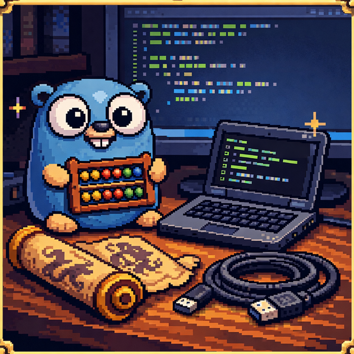

<p align="center">

</p>

-- 👋 Hi, I’m @jonathon-chew

-- 👀 I’m interested in Automation, creating tools to improve processes

-- 🌱 I’m currently learning Python, Go and Powershell

-- 💞️ I’m looking to collaborate on open source back end tools and scripts.

<!---
-hunteradder626/hunteradder626 is a ✨ special ✨ repository because its `README.md` (this file) appears on your GitHub profile.
-You can click the Preview link to take a look at your changes.
---->

```bash
-Git Commit Calendar - not just public github repos
Total Count: 964
________________+               March
+++__+___________+_+++___+++++  April
___+____+____+_______+__+++++_+ May
___________+_+_+++++_______+++  June
++__+++___+____________________ July
________________+______________ August
______+_++_+_+_++___+__+__++++  September
_+++__+__++++______+_+++_+++++_ October
+_+_______++___++______+_+____  November
_+________+______++____+__+++++ December
__+++__+_++_+++++++++++++_+_+__ January
+++_++_+____+++_++++++_____+    February
+_________++++                  March
```
